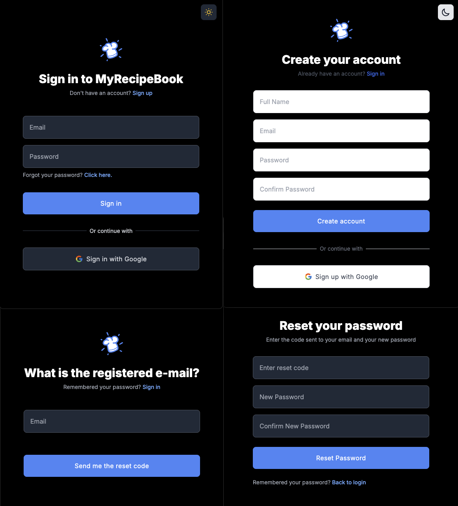
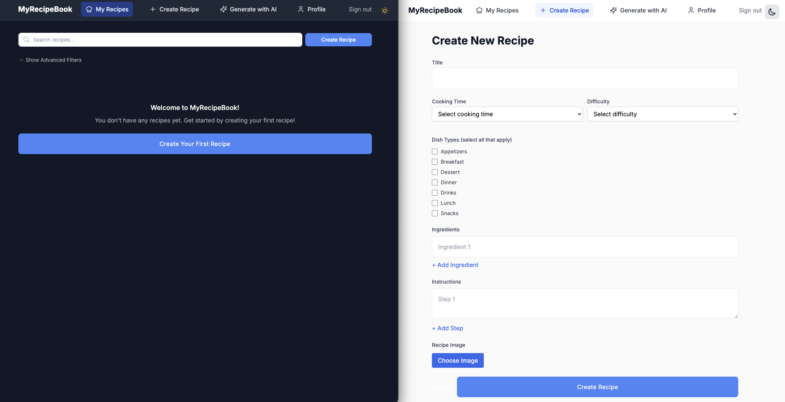
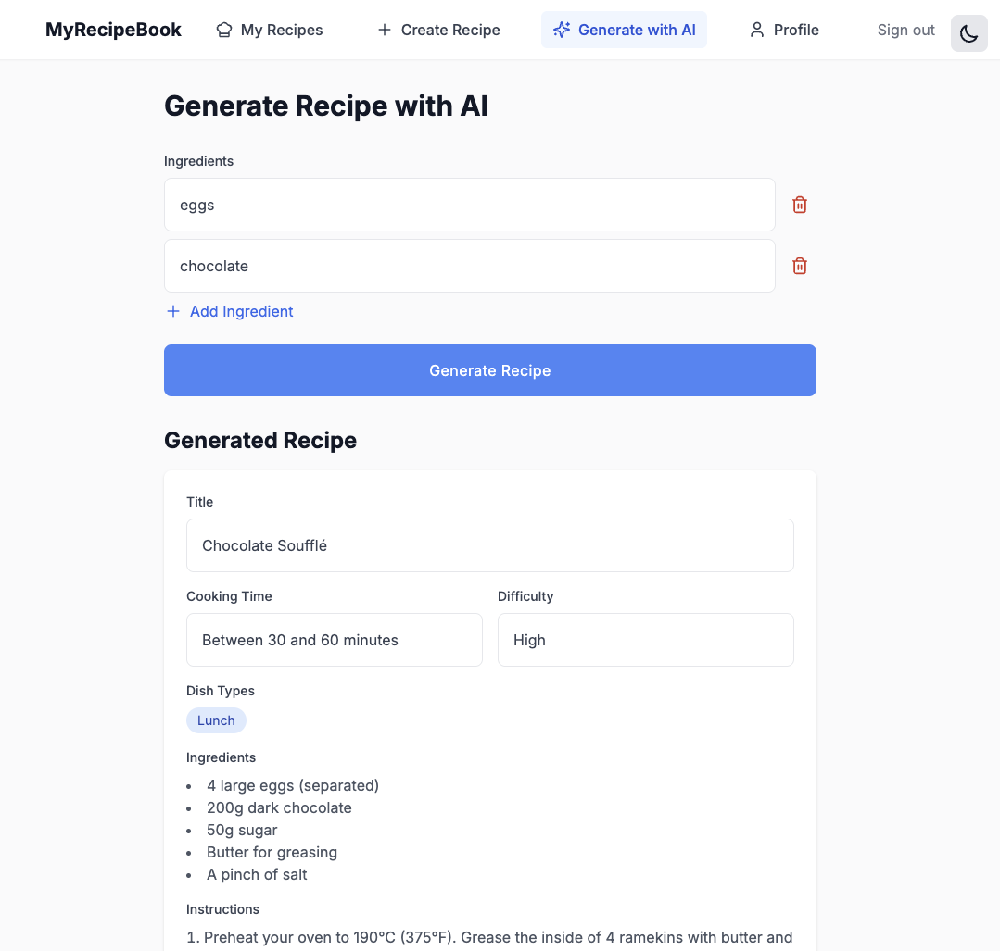
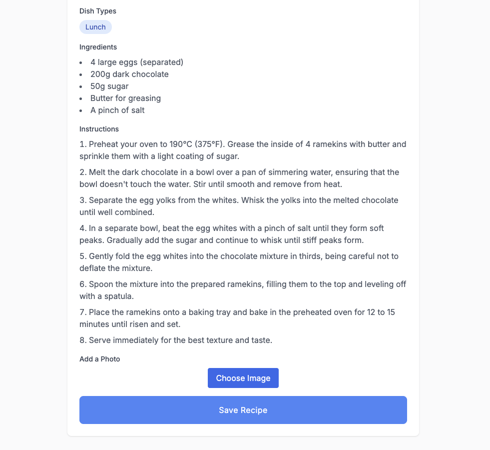
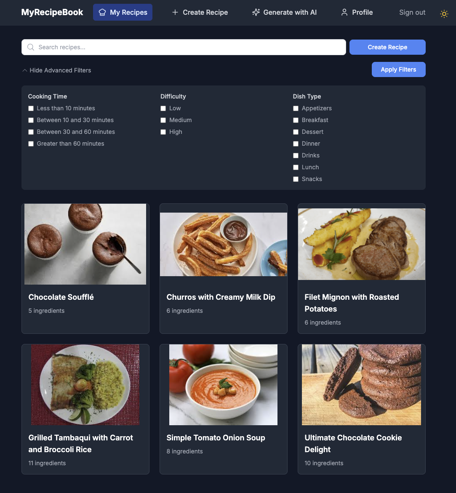

# MyRecipeBook Frontend

This repository is a submodule of the [MyRecipeBook Full-Stack Application](https://github.com/damasceno-dev/myRecipeBook), 
which consists of three main parts:
- Infrastructure (AWS resources)
- Backend API
- Frontend Application (this repository)

## About the Application

MyRecipeBook is a modern web application that helps users manage their recipes with a beautiful and intuitive interface. The application features:

- 🔐 Secure authentication with Google OAuth
- 🌙 Dark mode support
- 📱 Responsive design for all devices
- 🔍 Advanced recipe search and filtering
- 🤖 AI-powered recipe generation
- 📝 Easy recipe creation and management

### Screenshots

#### Login Screen


#### Create New Recipe


#### AI Recipe Generation



#### Recipes Dashboard and Search


## Configuration

### Authentication Setup

This application uses Google OAuth for authentication, which is configured in the backend project. The frontend receives the necessary credentials (`GOOGLE_CLIENT_ID` and `GOOGLE_CLIENT_SECRET`) from the backend's configuration. These credentials are used by NextAuth.js to handle the OAuth flow and user authentication.

### AWS deploy using Amplify
The instructions focus on AWS deployment as the other projects are AWS-based; however, feel free to deploy
wherever suits your needs.

### Environment Variables

1. Copy the example environment file:
```bash
cp env-production-example .env.production
```

2. Update the following variables in `.env.production` with initial values just for reference:

```env
# Backend API URL (from AppRunner deployment)
NEXT_PUBLIC_API_URL=https://your-apprunner-service-url

# Frontend Application URL (will be updated after deployment)
NEXT_PUBLIC_AUTH_URL=https://your-amplify-web-url

# Google OAuth Configuration (obtained from backend project)
GOOGLE_CLIENT_ID=your_google_client_id
GOOGLE_CLIENT_SECRET=your_google_client_secret

# NextAuth Configuration
NEXTAUTH_URL=https://your-amplify-web-url  # Will be updated after deployment
NEXTAUTH_SECRET=your_nextauth_secret  # Required for secure authentication
```

To generate a secure NEXTAUTH_SECRET, you can use one of these methods:

```bash
# Method 1: Using openssl
openssl rand -base64 32

# Method 2: Using node
node -e "console.log(require('crypto').randomBytes(32).toString('base64'))"
```

> **Note**: The NEXTAUTH_SECRET is crucial for security. It's used to encrypt cookies and tokens, sign JWTs, and generate CSRF tokens. Make sure to use a strong, unique value and keep it secret.

## Deployment

### AWS Amplify Deployment Steps

1. **Initial Deployment**
   - Log in to the AWS Management Console
   - Navigate to AWS Amplify
   - Click "Deploy an app"
   - Choose your source code provider (GitHub) and select your branch
   - Configure build settings:
     ```
     App name: myRecipeBook
     Framework: Next.js (auto-detected)
     Build command: npm run build
     Build output directory: .next
     ```

2. **Environment Variables Setup**
   - Before the deployment, at the step App Settings, in Advanced Settings
   - Add the following environment variables with your initial values:
     ```
     NEXT_PUBLIC_API_URL=https://your-apprunner-service-url
     GOOGLE_CLIENT_ID=your_google_client_id
     GOOGLE_CLIENT_SECRET=your_google_client_secret
     NEXTAUTH_SECRET=your_nextauth_secret
     ```

3. **Update URLs After Deployment**
   - Once the deployment is complete, note down your Amplify application URL
   - Add the following environment variables in AWS Amplify:
     ```
     NEXT_PUBLIC_AUTH_URL=https://your-amplify-web-url
     NEXTAUTH_URL=https://your-amplify-web-url
     ```
   - Click "Save" to trigger a new deployment with the updated URLs
   - Update your local `.env.production` with the same URLs for reference

> **Note**: The `.env.production` file is only used for local development reference and to generate the api routes with orval.
> All production environment variables are managed through AWS Amplify's environment variables settings.

## Development

### Standard Development Environment

To run the application locally:

```bash
# Install dependencies
npm install

# Generate API types and functions for development
npm run generate:dev

# Run the development server
npm run dev
```

The application will be available at `http://localhost:3000`

### HTTPS Development Environment

For testing features that require secure connections (like OAuth), you can run the application with HTTPS:

1. Create an HTTPS environment file:
```bash
cp env-local-https-example .env.local.https
```

2. Update the environment variables in `.env.local.https`:
```env
# Use HTTPS URLs for development
NEXT_PUBLIC_API_URL=https://your-backend-url
NEXTAUTH_URL=https://localhost:3000
```

3. Generate API types and functions for HTTPS development:
```bash
npm run generate:dev:https
```

4. Start the HTTPS development server:
```bash
npm run dev:https
```

The application will be available at `https://localhost:3000`

> **Note**: The HTTPS development server uses a self-signed certificate. Your browser will show a security warning - this is expected in development. You can proceed by accepting the security risk.

### Available NPM Scripts

- `npm run dev`: Start the development server (HTTP) using .env.local
- `npm run dev:https`: Start the development server with HTTPS using .env.local.https
- `npm run dev:prod`: Start the development server (HTTP) using .env.production to test against the production API
- `npm run build`: Generate production API types and build the Next.js application
- `npm run build:test`: Build the application and start the production server locally for testing
- `npm run start`: Start the production server
- `npm run generate:dev`: Generate API types and functions for development environment
- `npm run generate:dev:https`: Generate API types and functions for HTTPS development environment
- `npm run generate:prod`: Generate API types and functions for production environment

### Environment Files

The application uses different environment files for various scenarios:

- `.env.local`: Used for standard development with HTTP
- `.env.local.https`: Used for development with HTTPS (required for OAuth testing)
- `.env.production`: Used for:
  - Local testing against the production API
  - Reference for production environment variables
  - Generating production API types with orval

> **Note**: The `.env.production` file is only used for local development reference and to generate the API routes with orval.
> All production environment variables are managed through AWS Amplify's environment variables settings.

## Contributing

1. Fork the repository
2. Create your feature branch
3. Commit your changes
4. Push to the branch
5. Create a new Pull Request
